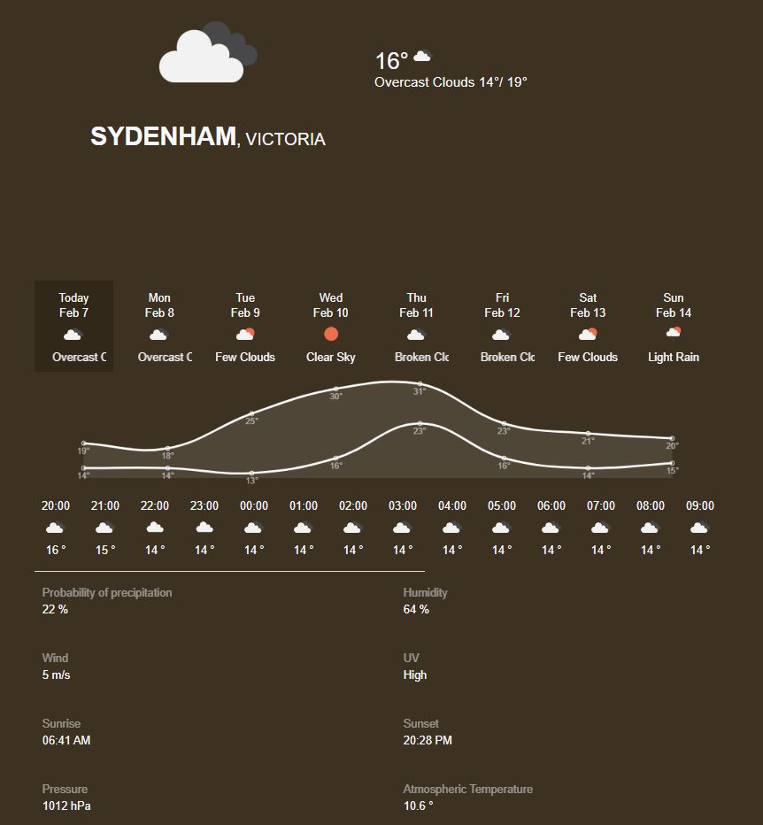
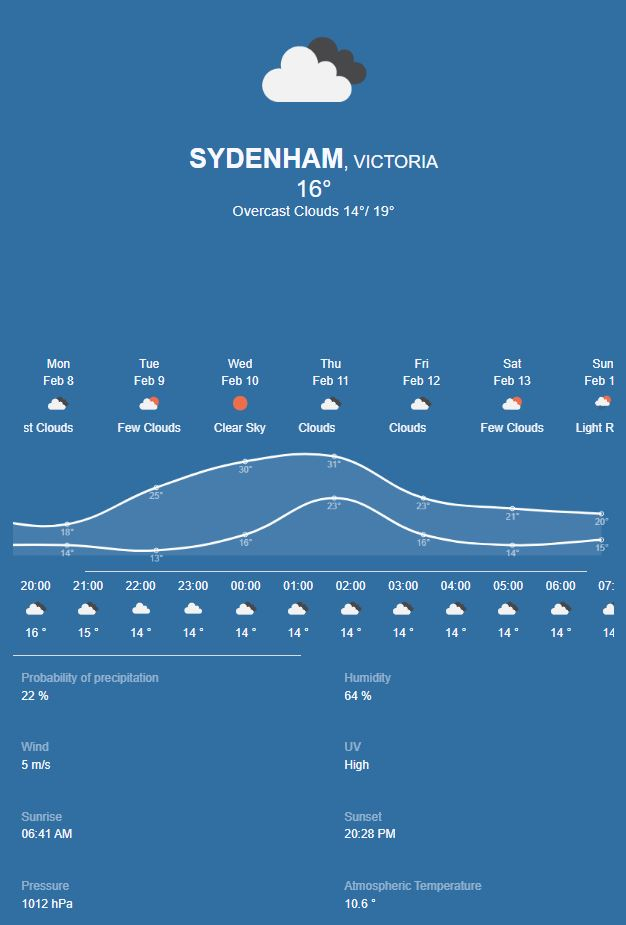
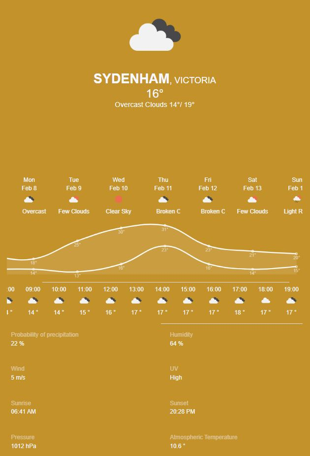
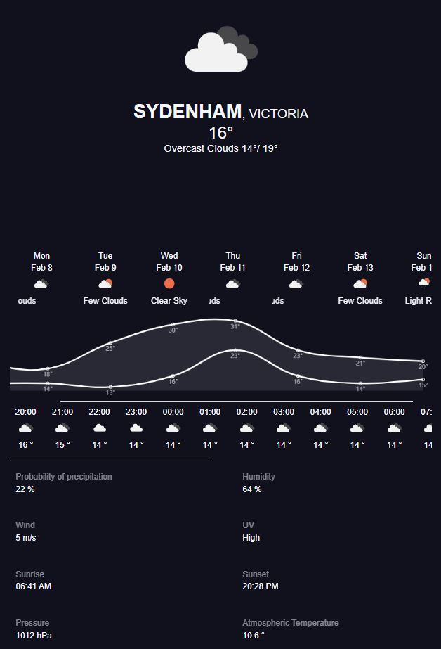

# MyWeatherApp

Angular application to show the current weather and forecast for your location using OpenWeatherMap API

* The App changes the color according to the current time. Or the color changes when you click the hour card.

| Morning    | Evening     | Night     |
|------------|-------------|-------------|
|  |  |  |

* On Selecting future dates, rest of the data changes accordingly and hours data will be hidden since it is not available.

Open Weather Map API and Google Map API is used to get the details for this application

Use the [link](https://weather.fotis.com.au/) for live demo!

This project was generated with [Angular CLI](https://github.com/angular/angular-cli) version 11.1.4.

## Development server

Run `ng serve` for a dev server. Navigate to `http://localhost:4200/`. The app will automatically reload if you change any of the source files.

## Build

Run `ng build` to build the project. The build artifacts will be stored in the `dist/` directory. Use the `--prod` flag for a production build.

## Running unit tests
Testing is done in karma to test the utility functions
Run `ng test` to execute the unit tests via [Karma](https://karma-runner.github.io).

